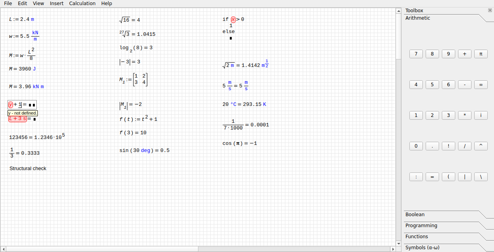
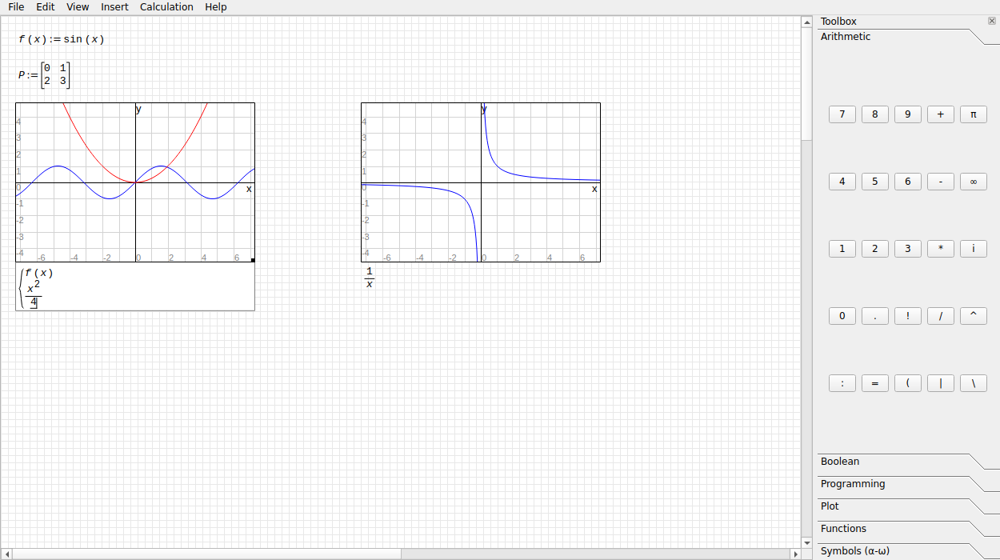

# WebSMath

A Python desktop replica of the **SMath Studio Cloud** worksheet
(smath.com/en-US/cloud). It copies the equation editor, evaluation, errors and
maths formatting as closely as possible: keystroke rules, the `=`/`:=`
decision, units, number formatting, error tips and autocomplete all follow
what the website does. The UI is a plain PySide6 window.





**How it was matched.** Every behaviour was read back from the live site with
an automated driver; the method and all findings are in
[docs/SMATH_BEHAVIOUR.md](docs/SMATH_BEHAVIOUR.md). The SMath Studio install
in `smath/SMath Studio/` supplied the unit table (`Units.xml`), the formatting
preset and example worksheets. The tests check our results against the
results SMath saved in those example files.

## Run

```bash
python -m pip install PySide6          # numpy/pytest only for development
python -m websmath                     # or: python -m websmath file.sm
```

On a headless machine set `QT_QPA_PLATFORM=offscreen`. Tests:

```bash
QT_QPA_PLATFORM=offscreen python -m pytest websmath/tests -p no:faulthandler
```

## What it does

* **Worksheet:** a 9 px grid with a red-cross insertion point. Type anywhere to
  start a math region. Enter leaves it, Tab moves to the next region, and you
  can drag regions around. Order is position: a region only sees what is
  defined above or to the left of it.
* **Evaluation timing, as on the site:** the region being edited is
  recalculated on every keystroke (a result appears as soon as `=` is typed);
  the rest of the worksheet is recalculated when you leave the region.
* **`=` versus `:=`:** `x=` defines `x` when `x` is not defined yet, and
  evaluates it otherwise. `:` always defines. The cursor stays on the
  left-hand side after `=`.
* **Structural editing:**
  * `/` takes the operand on its left into a numerator, and typing continues
    in the denominator.
  * `^` opens an exponent; typing stays in it until Right-arrow.
  * `(` opens a bracket, and `)` does not close it, exactly as on the site.
    Right-arrow leaves it.
  * `[` makes an index, `.` a literal subscript, `|` an absolute value.
  * `if(`, `line(`, `mat(`, `sqrt(`, `nthroot(` and `abs(` become blocks,
    radicals and matrices.
  * Space cycles the selection through the enclosing sub-expressions, and
    dragging with the mouse selects too. With a selection, `(` brackets it,
    `/` makes it a numerator, `^` raises it to a power, `\` puts it under a
    root, and an operator continues after it (bracketing it when needed),
    all as observed on the site.
  * Backspace unwraps structures.
  * Undo and redo work per keystroke.
* **Plots:** `@` (or Insert ▸ 2D plot) inserts a 2-D plot drawn like
  SMath's. Type a function of `x` under it, and a comma adds another curve;
  a two-column matrix plots points. The wheel zooms (Ctrl: x only, Shift:
  y only), dragging pans, the corner resizes. Plots load from and save to
  `.sm`.
* **Text regions:** space after a lone name turns the region into text, as
  does `"` as the first key. Backspace doesn't turn it back; undo does.
* **Numbers:** 4 decimal places and exponential threshold 5 by default
  (123456 → 1.2346·10⁵). Decimal places, threshold, significant-figures mode
  and trailing zeros are in the Calculation menu.
* **Units:** typed with an apostrophe (`5'kN`, `'m/'s^2`), using SMath's own
  unit table (284 units and constants, SI prefixes, °C/°F offsets). Results
  use SMath's derived units (N, J, Pa, W, Hz…). Where SMath would write an
  odd mix such as `m Pa`, the replica uses the engineering form instead
  (N/m, N/m³, W/m², J/K). Type a unit after the result,
  or double-click the answer, to convert it.
* **Errors:** the offending part is outlined in red, and a yellow tip appears
  under the region being edited. Messages are SMath's own: `x - not defined.`,
  `Units don't match.`, `Fill in all empty elements.`, `Syntax is incorrect.`,
  `Operation cannot be performed with units.`,
  `f(#) - function is not defined.`
* **Autocomplete:** substring matches over units, functions, constants and
  worksheet variables, units first, styled like the site.
* **Functions:** the site's catalogue, in these groups:
  * trigonometry and hyperbolics, logarithms, roots, factorial, `mod`,
    rounding;
  * `if`/`for`/`while`/`line`/`try`, `break`/`continue`;
  * matrices (`det`, `invert`, `transpose`, `el`, `max`, `min`, `sum`,
    `sort`, `augment`, `stack`, …);
  * strings;
  * numeric `int`, `diff`, `solve`, `sum`/`product` over a range,
    interpolation, `polyroots`;
  * user-defined functions `f(x):=…`.
* **Files:** opens and saves SMath `.sm` worksheets (RPN math, contract
  units, areas). `io.smfile.dumps`/`loads` give the same XML as a string for
  embedding.

Not replicated: SMath's *symbolic* engine (symbolic differentiation,
polynomials in an undefined variable), 3-D and polar plots, and pictures. Worksheets that need
them open, but those results show errors.

## Layout

```
websmath/
  engine/          Qt-free maths: no GUI imports
    model.py         rows and boxes the editor edits (Frac, Pow, Paren, Matrix, Program…)
    parser.py        row -> AST, SMath precedence, implicit number·unit
    evaluator.py     evaluation, symbolic (lazy) definitions, user functions
    builtins.py      the function catalogue and the programming constructs
    units.py         quantities, dimension vectors, output-unit choice
    unitdata.py      generated from SMath's Units.xml (tools/gen_units.py)
    numformat.py     decimal places / exponential threshold / significant figures
    display.py       values -> display structures (number, unit fraction, matrix)
    catalog.py       function and unit lists as served by SMath Cloud
    errors.py        SMath's error messages
  editor.py        keystroke-level editor for one region (Qt-free)
  worksheet.py     regions, reading-order evaluation, per-region recalculation
  io/smfile.py     .sm load/save
  ui/              PySide6
    layout.py        typesetting: fractions, radicals, matrices, blocks, results
    region_item.py   one region as a QGraphicsObject (paint, cursor, error tip, hit test)
    worksheet_view.py grid, cross, keyboard/mouse, autocomplete
    mainwindow.py    menus and toolbox
  tests/           behaviour tests (keystroke replays), .sm files, UI
```

## Integrating with MarkForge (later)

MarkForge (branch `claude/markforge-mupdf-pdf-handling-vpyj1t`) is a PySide6
`QGraphicsScene` application. Every markup is a `MarkupItem(QGraphicsObject)`,
registered with `@register_item`, keyed by `TYPE`, and saved through
`serialize`/`deserialize`. WebSMath is laid out so it drops into that model
without changes to MarkForge's core:

* The engine (`engine/`, `editor.py`, `worksheet.py`) has no Qt dependency. A
  MarkForge item can own a `Worksheet` directly.
* `ui.region_item.RegionItem` is already a `QGraphicsObject` that only needs a
  `Region`, the `Worksheet` and a `Style`. A future
  `CalcItem(MarkupItem)` (`TYPE = "calc"`) can hold `RegionItem`s as child
  items on a page. Its `serialize()` stores `{"sm": io.smfile.dumps(ws)}`, and
  `deserialize()` calls `io.smfile.loads(...)`.
* The keyboard and mouse behaviour lives in `WorksheetView` methods
  (`_key_to_region`, `_named_key`, `_enter`, `focus_item`,
  `update_suggestions`). MarkForge's view can forward key events to the same
  methods while a calc item is being edited, or those methods can be moved
  into a small controller shared by both views.
* Nothing in MarkForge was changed.
